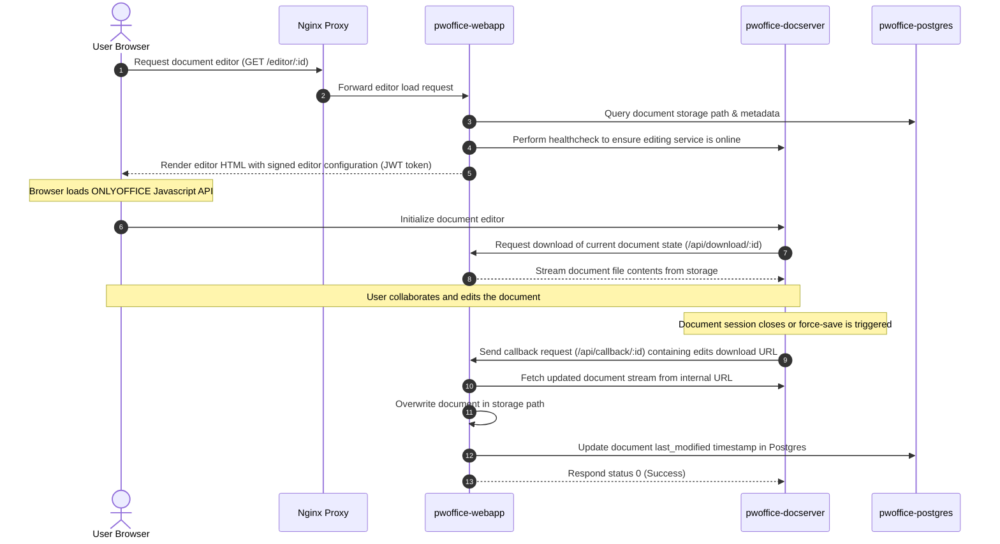

# PW Office System Architecture Reference

This document serves as the permanent reference architecture and operations guide for the **PW Office** deployment.

---

## 1. System Topology

Below is the network topology and component diagram representing the flow of external user requests, reverse proxying, internal container communication, and database connectivity.

```mermaid
graph TD
    Browser([User Browser]) -->|Ports 80/443 (HTTP/HTTPS)| Nginx[pwoffice-nginx]
    
    subgraph Docker Bridge Network (pwoffice-network)
        Nginx -->|Proxy /api/download, /api/callback, etc.| WebApp[pwoffice-webapp:3000]
        Nginx -->|Proxy /web-apps, /sdk, etc.| DocServer[pwoffice-docserver:80]
        WebApp -->|Query / pgpool| Postgres[(pwoffice-postgres:5432)]
        DocServer -->|Fetch documents & trigger saves| WebApp
    end

    WebApp -.->|External API Requests| Groq[Groq LLM API]
```

---

## 2. Container Inventory

The following containers constitute the authoritative stack running on the host system:

| Container Name | Image Name | Host Port | Purpose |
| :--- | :--- | :--- | :--- |
| **`pwoffice-nginx`** | `nginx:alpine` | `80:80`, `443:443` | Reverse proxy and SSL termination (Certbot). Routes general web traffic to the Express webapp, and ONLYOFFICE-specific static assets/editors to the Document Server. |
| **`pwoffice-webapp`** | Local build (Node 18) | `3000:3000` | Express application managing workspaces, documents, user authentication, and LLM integrations. |
| **`pwoffice-docserver`** | `pwoffice-server:final` | *Exposed Internally* | **Authoritative Branded Document Server.** Contains the compiled and branded custom files (e.g. customized logos, loader animations, and customer titles). Exposes port 80 only to the container bridge network. |
| **`pwoffice-postgres`** | `postgres:15` | `5432:5432` | Relational database containing user schemas, workspace associations, document metadata, and JWT blacklists. |
| **`pwoffice-certbot`** | `certbot/certbot` | *None* | Automates Let's Encrypt SSL certificate checks and renewal actions on a 12-hour schedule. |

---

## 3. Rebuilding the Branded Document Server Image

If logos, titles, or UI elements in ONLYOFFICE need to be updated, rebuild the branded image using the following procedure:

1. **Locate the Source Files:**
   The customizable elements reside in the `branding-source/` directory:
   - `branding-source/web-apps/` — Custom loader icons, icons, product CSS styling, and default config templates.
   - `branding-source/sdkjs/` — Custom JS scripts and core editor behavior files.

2. **Dockerfile Definition:**
   The image `pwoffice-server:final` is constructed by copying these files onto the base document server. The build context is executed using the following `Dockerfile` structure:
   ```dockerfile
   FROM onlyoffice/documentserver:latest
   COPY web-apps /var/www/onlyoffice/documentserver/web-apps
   COPY sdkjs /var/www/onlyoffice/documentserver/sdkjs
   ```

3. **Rebuild Command:**
   Run the following command from the root of the project to compile and tag the new branded container image:
   ```bash
   docker build -t pwoffice-server:final -f branding-source/build_tools/develop/Dockerfile branding-source
   ```

---

## 4. Key Data Flows

### 4.1 Signup & Login Sequence
1. The user inputs their credentials at the landing page and submits a `/signup` or `/login` POST request.
2. Nginx forwards the traffic to the `pwoffice-webapp` Express container.
3. The WebApp hashes passwords using `bcrypt` and performs SQL queries against `pwoffice-postgres`.
4. Upon successful validation, the WebApp returns a secure, HTTP-only, `sameSite: strict` JWT token cookie to the browser and redirects the user to `/workspaces`.

### 4.2 Document Edit & Save Callback Flow


---

## 5. Environment Variables Guide

The following parameters must be configured in `.env` inside `/opt/pwoffice` before starting the services:

- `PORT`: Port on which the Express webapp runs inside its container (default: `3000`).
- `NODE_ENV`: Application environment (set to `production`).
- `JWT_SECRET`: Shared encryption key used to sign session cookies and ONLYOFFICE configuration payloads.
- `DOCUMENT_SERVER_PUBLIC_URL`: Public HTTPS URL of the Document Server (e.g., `https://pwoffice.yourcompany.com`).
- `DOCUMENT_SERVER_INTERNAL_URL`: Internal URL for Webapp-to-DocumentServer calls (defaults to `http://docserver` inside Docker network).
- `WEBAPP_PUBLIC_URL`: Public HTTPS URL of the Express webapp (e.g., `https://pwoffice.yourcompany.com`).
- `WEBAPP_INTERNAL_URL`: Internal network URL of the Webapp (e.g., `http://webapp:3000`).
- `GROQ_API_KEY`: API token used for chatbot integrations on landing pages and editor screens.
- `PGHOST`: PostgreSQL hostname (set to `postgres` in docker-compose, `localhost` for host testing).
- `PGPORT`: PostgreSQL port (default: `5432`).
- `PGUSER`: Username for database administrator (`pwadmin`).
- `PGPASSWORD`: Password for the PostgreSQL user.
- `PGDATABASE`: Name of the database (`pwoffice`).

---

## 6. Known Limitations & Constraints

- **No Email Verification Pipeline:** Although email verification tables exist, emails are simulated via server log outputs. Users are verified by default at registration.
- **Single-Node Execution:** Currently designed for single-VM hosts. Horizontal scale-out would require shared storage mounts (e.g., NFS/GCS fuse) for the documents directory and session/websocket synchronization.
- **Self-Signed Certificates for Dev/Local:** Certificate paths require matching Let's Encrypt file paths. Local runs map mock files to satisfy Nginx startup checks.
