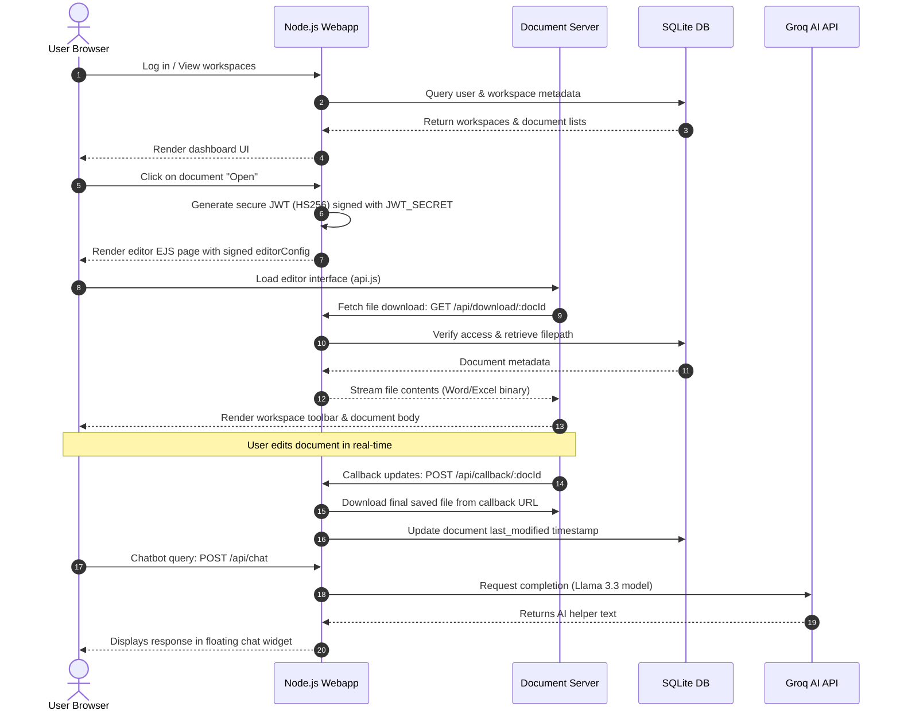

# PW Office Architecture Documentation

This document describes the services, network ports, and data flow for the production deployment of **PW Office**.

---

## Services & Port Mapping

| Service | Technology | Port (Internal) | Port (Public) | Description |
| :--- | :--- | :--- | :--- | :--- |
| **PW Office Webapp** | Node.js (Express, EJS) | `3000` | `3000` (or `80`/`443` via reverse proxy) | User portal, authentication, workspace management, document dashboard, and AI chatbot proxy. |
| **Document Server** | ONLYOFFICE Document Server | `80` | `8080` (or `/` path routing via proxy) | Rendering and document editing engine. |
| **Database** | SQLite (currently local file) | — | — | Storage of user credentials, workspaces metadata, and document reference metadata. |
| **Groq AI Gateway** | Groq Cloud API | HTTPS (443) | — | External API used for document assistance and formula guidance chat completions. |

---

## Data Flow Diagram

---

## Network & Security Architecture

1. **Authentication**: Cookie-based JWT authentication (`auth_token`) signed with a secure, random `JWT_SECRET`.
2. **Editor Protection**: All communications between the browser client and the ONLYOFFICE Document Server are protected using JWT signatures (`HS256`) signed with the same `JWT_SECRET`.
3. **Data Isolation**: Document assets are saved dynamically under `storage/<workspaceId>` folders on persistent storage volumes. Database queries enforce checking whether the logged-in user belongs to the requested workspace before exposing access routes.
